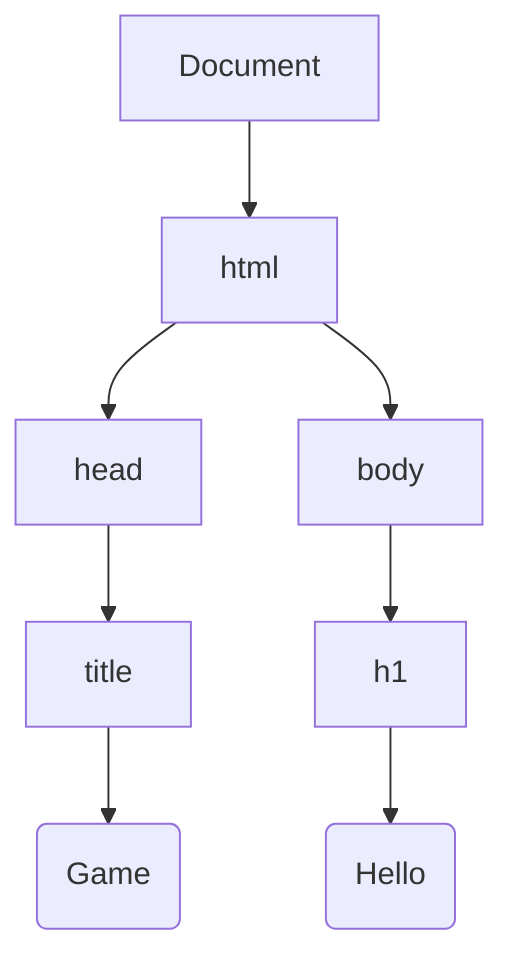

# Лекція 1: HTML як Дерево (DOM) та Інженерія Парсингу

## ⚡ Експрес-опитування: Налаштування контексту

Ми починаємо курс. Давайте перевіримо вашу інтуїцію. Не гугліть, просто спробуйте вгадати.

1.  Ви відкрили сайт, натиснули `F12` і видалили шматок HTML-коду. Чи зник цей шматок для інших користувачів інтернету?
2.  Уявіть папку на комп'ютері. Якщо ви видалите папку, що станеться з файлами всередині неї?
3.  Чим відрізняється поведінка програми на C++ і веб-сторінки, якщо в коді допущено синтаксичну помилку (наприклад, забули закрити дужку)?

<details markdown="1">
<summary>Відповіді (розгорнути)</summary>

1.  **Ні.** Ви змінили лише локальну копію сайту у вашій оперативній пам'яті (у вашому браузері). Сервер це не зачепило.
2.  **Вони зникнуть.** Це фундаментальна властивість деревоподібної структури: видалення батька вбиває дітей. HTML працює так само.
3.  **Відмовостійкість.** C++ зазвичай не скомпілюється або впаде (Crash). Браузер же спробує "вгадати", що ви мали на увазі, і покаже сторінку, навіть якщо вона "крива". Сьогодні ми дізнаємось, якою ціною це досягається.

</details>

---

## 1. Фундаментальна концепція: Дерево (Tree)

Перш ніж говорити про теги, згадаємо Computer Science.
Браузер бачить ваш код не як плаский текст, а як структуру даних — **Дерево**.

* **Вузол (Node):** Будь-який елемент.
* **Корінь (Root):** Головний вузол (`<html>`).
* **Батько (Parent) і Діти (Children):** Вкладеність визначає ієрархію.

### 🤔 Міні-челендж: Знайдіть "Родичів"

Подивіться на цей код:
```html
<div>
    <p>Привіт</p>
    <a href="#">Клік</a>
</div>
```

Які родинні зв'язки між:

1.  `<div>` і `<p>`?
2.  `<p>` і `<a>`?

<details markdown="1">
<summary>Відповідь</summary>

1.  `<div>` — це **Parent** (Батько), `<p>` — це **Child** (Дитина).
2.  `<p>` і `<a>` — це **Siblings** (Брати/Сестри), оскільки вони мають спільного батька і знаходяться на одному рівні вкладеності.

</details>

-----

## 2\. DOM (Document Object Model)

Коли браузер завантажує сторінку, відбувається процес **Парсингу (Parsing)**. Текст перетворюється на об'єкти в пам'яті (Heap). Ця структура об'єктів називається **DOM Tree**.

### Візуалізація інженера:

```html
<html>
  <head>
    <title>Game</title>
  </head>
  <body>
    <h1>Hello</h1>
  </body>
</html>
```

**Як це бачить рушій браузера:**



> **Інсайт:** Ви бачите текст "Hello", але для DOM це окремий тип вузла — **Text Node**, який є дитиною вузла `h1`.

-----

## 3\. Fault Tolerance: Браузер вибачає все

Це те, що шокує програмістів на C++/Java. Браузери мають евристичні алгоритми, щоб виправляти помилки розробників на льоту.

### 🛠 Інтерактив: "Хірургія коду"

Спробуйте написати такий "битий" код (порушення вкладеності):

```html
<p>Привіт <b>Світ</p></b>
```

**Питання:** Як браузер це відрендерить?

1.  Видасть помилку?
2.  Зробить все жирним?
3.  Перебудує структуру?

<details markdown="1">
<summary>Що відбудеться насправді (Відповідь)</summary>

Браузер застосує алгоритм "Foster Parenting" або подібний механізм виправлення. У DevTools ви побачите:

```html
<p>Привіт <b>Світ</b></p>
```

Браузер примусово закрив `</b>` перед закриттям `</p>`, а зайвий `</b>` проігнорував.
**Висновок:** `View Source` (вихідний код) і `Inspect Element` (DOM) — це дві різні реальності.

</details>

-----

## 4\. Семантика: HTML для Роботів

Ви можете побудувати сайт тільки на тегах `<div>`. Він працюватиме. Але це погана інженерія.
Семантика — це пояснення **сенсу** контенту для машин (Google Bot, Screen Reader).

| Non-semantic | Semantic | Що "чує" робот |
| :--- | :--- | :--- |
| `<div class="btn">` | `<button>` | "Це інтерактивний елемент, на нього можна натиснути Enter" |
| `<div class="nav">` | `<nav>` | "Тут основна навігація сайту" |
| `<b>Bold</b>` | `<strong>` | "Це важливо\! (підвищити інтонацію)" |

-----

## ✅ Контрольні питання

1.  **Архітектура:** Чому, коли ми видаляємо вузол `<body>` через JavaScript або DevTools, зникає весь контент сторінки?
2.  **DOM vs HTML:** Ви написали в файлі `<input type="text">`. Користувач ввів туди слово "Hello". Чи змінився HTML-файл? Чи змінився DOM?
3.  **Інженерія:** Чому використання тегу `<button>` краще, ніж `<div onclick="...">` з точки зору доступності (Accessibility)?

<details markdown="1">
<summary>Відповіді (Перевірте себе)</summary>

1.  **Принцип Дерева:** `<body>` є батьківським вузлом для всього видимого контенту. При видаленні вузла автоматично видаляються всі його нащадки (children/descendants) з пам'яті.
2.  **HTML незмінний, DOM живий:** HTML-файл на сервері залишився незмінним. Але DOM-дерево в пам'яті браузера оновилося — атрибут `value` вузла `input` змінився на "Hello".
3.  **Доступність:** Тег `<button>` "з коробки" підтримує фокус клавіатури (Tab), натискання через Enter/Space та повідомляє скрінрідерам, що це кнопка. Для `div` цю поведінку довелося б програмувати вручну.

</details>

-----

## 🏠 Домашнє завдання: "Скелет"

Створіть репозиторій. Напишіть `index.html` для гри "Камінь-Ножиці-Папір", використовуючи тільки семантичні теги (`header`, `main`, `section`, `footer`, `button`).
Додайте в `<head>` мета-теги Open Graph, щоб посилання на ваш файл гарно виглядало в Telegram.