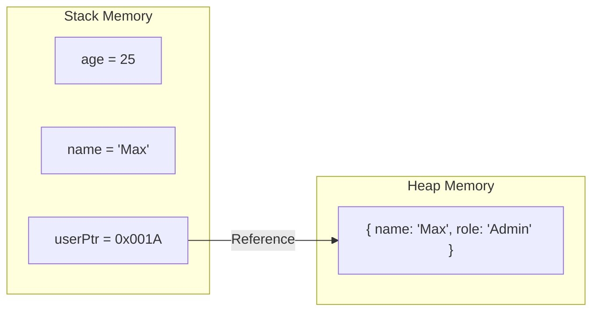

# Лекція 3: JavaScript Runtime. Пам'ять та Посилання

## Експрес-опитування: "Дивна" поведінка

Спробуйте передбачити результат виконання коду **до** того, як запустите його в консолі.

1.  **Математика:**
    ```javascript
    console.log(0.1 + 0.2 === 0.3); // true чи false?
    ```
2.  **Константи:**
    ```javascript
    const user = { name: "Ivan" };
    user.name = "Petro"; 
    // Це помилка? Ми ж змінили const!
    ```
3.  **Копіювання:**
    ```javascript
    let a = { val: 10 };
    let b = a;
    b.val = 20;
    console.log(a.val); // Що виведе a? 10 чи 20?
    ```

<details markdown="1">
<summary>Відповіді (Інженерний погляд)</summary>

1.  **False.** Результат `0.30000000000000004`. Це стандарт **IEEE 754** для чисел з плаваючою крапкою (double precision).
    
    **Інженерна довідка:**
    Комп'ютер зберігає числа у двійковій системі. Деякі десяткові дроби (як 0.1 або 0.2) є нескінченними періодичними дробами у двійковій системі (як 1/3 у десятковій).
    
    * **Абсолютна похибка:** Різниця між реальним числом і його представленням у пам'яті (тут це `0.00000000000000004`).
    * **Відносна похибка:** Відношення абсолютної похибки до самого числа. У `double` вона складає приблизно $10^{-16}$.
    
    **Як це фіксити:** Для фінансів використовуйте спеціальні бібліотеки (наприклад, `Decimal.js`) або працюйте в копійках (цілих числах), а діліть на 100 лише при виводі на екран.

2.  **Не помилка.** `const` захищає **посилання** (адресу в пам'яті), а не вміст об'єкта в Heap.
3.  **20.** Ви скопіювали не об'єкт, а посилання на нього. Тепер `a` і `b` дивляться на один і той самий шматок пам'яті.

</details>

---

## 1. V8 Engine: Серце браузера

JavaScript — це не магія. Це текст, який "згодовується" двигуну (Engine). Найпопулярніший — **V8** (Chrome, Node.js) .

### Як це працює "під капотом"?
1.  **Parsing:** Текст перетворюється на дерево (AST - Abstract Syntax Tree).
2.  **Compilation (JIT):** V8 не просто інтерпретує код рядок за рядком. Він компілює гарячі шматки коду в машинний код (Machine Code) прямо під час виконання для швидкості .

> **Інсайт:** Саме тому JS сьогодні майже такий же швидкий, як C++ у деяких задачах, і на ньому можна писати сервери та ігри.

---

## 2. Пам'ять: Stack vs Heap

Це найважливіша концепція для розуміння продуктивності та багів .

### Stack (Стек) — Порядок і Швидкість
Це проста стопка даних.
* **Що тут зберігається:** Примітиви (`number`, `boolean`, посилання) та виклики функцій.
* **Особливість:** Швидкий доступ, фіксований розмір. Дані зникають, коли функція завершується .

### Heap (Купа) — Хаос і Об'єкти
Це великий "склад" пам'яті.
* **Що тут зберігається:** Об'єкти `{...}`, Масиви `[...]`, Функції.
* **Особливість:** Повільніший доступ, динамічний розмір. Об'єкти живуть тут, поки на них хтось посилається .

### Візуалізація:



> **Важливо:** Коли ви створюєте об'єкт `const user = {}`, у Стеку створюється змінна `user` (яка важить 8 байт і містить адресу), а в Купі виділяється пам'ять під сам об'єкт.

-----

## 3\. Reference Types: Пастка посилань

В JS є два типи даних :

1.  **Primitives (Value Types):** `String`, `Number`, `Boolean`, `Null`, `Undefined`.
      * Копіюються **за значенням**. `a = 5; b = a`. `b` — це незалежна копія.
2.  **Reference Types:** `Object`, `Array`, `Function`.
      * Копіюються **за посиланням**. `a = {}; b = a`. `b` — це те саме, що `a`.

### Інтерактив: "Зламаний клон"

Відкрийте консоль (`F12`) і введіть:

```javascript
let original = { settings: { theme: "dark" } };
let fakeCopy = original; // Це не копія!
let realShallowCopy = { ...original }; // Це поверхнева копія

fakeCopy.settings.theme = "light";
console.log(original.settings.theme); // "light" -> ОЧІКУВАНО

realShallowCopy.settings.theme = "blue";
console.log(original.settings.theme); // "blue" -> ЩО?! Чому shallow copy змінив оригінал?
```

**Пояснення:**
`spread` оператор (`...`) копіює тільки перший рівень об'єкта. Вкладений об'єкт `settings` — це все ще посилання на стару пам'ять. Це називається **Shallow Copy** .

Щоб зробити справжню копію (Deep Copy), треба використати `structuredClone(original)` або `JSON.parse(JSON.stringify(original))` (старий хак).

-----

## 4\. Garbage Collection (Сміттєзбірник)

В С++ ви маєте вручну виділяти і звільняти пам'ять (`malloc`/`free`).
В JS за вами прибирає **Garbage Collector (GC)**.

**Алгоритм (Mark-and-Sweep):**

1.  GC починає з кореня (Global Object).
2.  Він "мітить" (Mark) усі об'єкти, до яких можна дістатися по посиланнях.
3.  Все, що залишилося не поміченим (до чого не можна дістатися) — видаляється (Sweep) .

> **Memory Leak (Витік пам'яті):** Якщо ви поклали об'єкт у глобальний масив і забули про нього, GC не зможе його видалити, бо на нього є посилання.

-----

## Контрольні питання

1.  Чому `const a = []; a.push(1)` працює, а `const a = 1; a = 2` видає помилку?
2.  Де зберігається змінна `let x = 10` — у Стеку чи в Купі? А `let y = { val: 10 }`?
3.  Як правильно скопіювати масив об'єктів, щоб зміни в копії не впливали на оригінал?

<details markdown="1">
<summary>Відповіді</summary>

1.  Масив — це Reference Type. `const` забороняє змінювати посилання (адресу), але дозволяє змінювати вміст "будинку" за цією адресою. Примітив — це значення, записане прямо в комірку, `const` блокує перезапис комірки.
2.  `x` у Стеку. `y` — посилання в Стеку, а сам об'єкт `{ val: 10 }` — у Купі.
3.  Потрібен **Deep Copy**. `[...arr]` зробить тільки поверхневу копію. Використовуйте `structuredClone(arr)`.

</details>

-----

## Домашнє завдання: "Stack Overflow"

1.  **Експеримент:** Напишіть рекурсивну функцію без умови виходу:

    ```javascript
    function boom() {
        boom();
    }
    boom();
    ```

    Запустіть у консолі. Що ви побачите? (`RangeError: Maximum call stack size exceeded`). Ви щойно переповнили **Stack**.

2.  **Завдання до гри:** У вашому коді гри (з минулої домашки) змінні рахунку (`score`) — це примітиви. А об'єкт `settings` (якщо є) — це посилання. Спробуйте створити функцію `resetGame`, яка повертає стан гри до початкового, не перезавантажуючи сторінку. Подумайте, як правильно "обнулити" об'єкти.