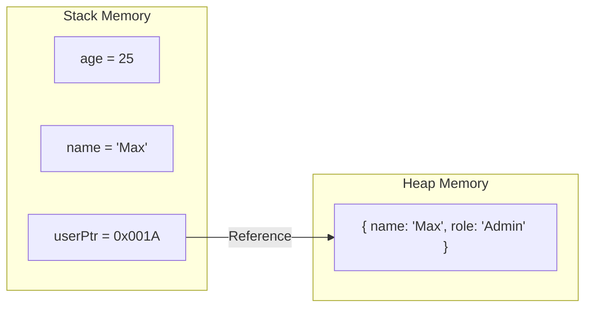

# Лекція 3: JavaScript Runtime. Пам'ять та Посилання

## Міні-план: як читати цю лекцію

Щоб **системно** зрозуміти JS (частина ідей — через **аналогію з C++**), зручно тримати в голові кілька опор і бачити, **де вони застосовуються**:

| Опора | Про що | Навіщо C++ у голові |
|--------|--------|----------------------|
| **Інтерпретація vs компіляція (+ JIT)** | Текст потрапляє у **движок** (наприклад V8); спочатку парсинг, потім **JIT** «догріває» гарячий код до машинних інструкцій. | У C++ зазвичай **AOT**: програма вже зібрана до запуску. У JS немає окремого кроку «збірки» перед кожним F5 — але сучасні рушії компілюють під час виконання. |
| **Пам'ять: Stack і Heap** | Де лежать **примітиви**, **посилання**, **виклики функцій** (стек) і де — **об'єкти** (купа). | Як **автоматичні змінні** vs **`new` / глобальна купа**; без цього не зрозуміти «чому дві змінні бачать одні дані». |
| **Значення vs посилання** | Примітиви копіюються **за значенням**; об'єкти — **за посиланням**. `const` «заморожує» прив'язку імені, не завжди вміст у купі. | **Копія структури** vs **два вказівники на один `malloc`-блок**; `const` біля вказівника vs `const` об'єкта. |
| **Поверхневі копії** | `{ ...obj }` копіює лише **верхній** рівень; вкладені об'єкти лишаються **спільними**. | Схоже на копіювання структури, де поле — це вказівник: новий «контейнер», той самий вкладений блок. |
| **JSON** | **Текстовий** формат даних; `stringify` / `parse` — міст між рядком і об'єктом у пам'яті. | Будь-яка **серіалізація** в рядок (на кшталт виводу в файл) — ідея та сама, синтаксис інший. |
| **Збірка сміття (GC)** | Пам'ять за об'єктами в купі **прибирає рушій**, коли на них ніхто не посилається. | У C++ — **`delete` / `free`** вручну; тут — інша модель володіння. |
| **Події (DOM)** | Браузер шле **події** (`click`, `mousemove`…); JS підписується через `addEventListener`. | Не «як у консольного C++»; ближче до **циклу подій** в GUI-фреймворках (callback на дію користувача). |

Далі в тексті порядок такий: спочатку **інтуїція з опитування**, потім **движок і JIT**, **стек/купа**, **посилання та копії**, коротко **JSON**, **GC**, нарешті **події та DOM** (зв'язок з CSS-лекцією). Якщо щось «не сходиться» — перевірте: **як виконується код? → де в пам'яті лежать дані? → це копія чи те саме посилання? → хто прибирає об'єкт? → чи підписаний код на подію?**

---

## Експрес-опитування: "Дивна" поведінка

Спробуйте передбачити результат **до** запуску в консолі. У коді лише **натяки** та **аналогії з C++**; розгорнуті відповіді — у блоці нижче.

1.  **Математика:**
    ```javascript
    // Натяк: у C++ для double теж не варто сліпо довіряти == після арифметики з дробами (IEEE 754).
    console.log(0.1 + 0.2 === 0.3);
    ```
2.  **Константи:**
    ```javascript
    // 1) Об'єкт у Heap; user — посилання (як вказівник на об'єкт у C++).
    const user = { name: "Ivan" };

    // 2) Це зміна поля всередині об'єкта, не рядок виду user = іншийОб'єкт.
    //    Натяк (C++): чим відрізняється «const на вказівнику» від «const на об'єкті»? p->name vs p = ...
    user.name = "Petro";
    ```
3.  **Копіювання:**
    ```javascript
    // 1) Один об'єкт у Heap; a — посилання (аналог User* a = new User(...) / взяття адреси об'єкта).
    let a = { val: 10 };

    // 2) Натяк (C++): що робить User* b = a; — з'являється другий об'єкт у купі чи друга змінна-вказівник?
    let b = a;

    // 3) Змінюємо через b. Перед виводом: скільки об'єктів { val: ... } у пам'яті — один чи два?
    b.val = 20;
    console.log(a.val);
    ```

    [🔍 Візуалізувати в Python Tutor](https://pythontutor.com/javascript.html#code=let%20a%20%3D%20%7B%20val%3A%2010%20%7D%3B%0Alet%20b%20%3D%20a%3B%0Ab.val%20%3D%2020%3B%0Aconsole.log%28a.val%29%3B&curInstr=0&mode=display&origin=opt-frontend.js&py=js&rawInputJSON=%7B%7D)

<details markdown="1">
<summary>Відповіді (Інженерний погляд)</summary>

1.  **False.** Результат `0.30000000000000004`. Це стандарт **IEEE 754** для чисел з плаваючою крапкою (double precision).
    
    **Інженерна довідка:**
    Комп'ютер зберігає числа у двійковій системі. Деякі десяткові дроби (як 0.1 або 0.2) є нескінченними періодичними дробами у двійковій системі (як 1/3 у десятковій).
    
    * **Абсолютна похибка:** Різниця між реальним числом і його представленням у пам'яті (тут це `0.00000000000000004`).
    * **Відносна похибка:** Відношення абсолютної похибки до самого числа. У `double` вона складає приблизно $10^{-16}$.
    
    **Як це фіксити:** Для фінансів використовуйте спеціальні бібліотеки (наприклад, `Decimal.js`) або працюйте в копійках (цілих числах), а діліть на 100 лише при виводі на екран.

2.  **Не помилка.** `const` захищає **посилання** (адресу в пам'яті), а не вміст об'єкта в Heap.
3.  **20.** Ви скопіювали не об'єкт, а посилання на нього. Тепер `a` і `b` дивляться на один і той самий шматок пам'яті.

</details>

---

## 1. V8 Engine: Серце браузера

JavaScript — це не магія. Це текст, який "згодовується" двигуну (Engine). Найпопулярніший — **V8** (Chrome, Node.js) .

### Як це працює "під капотом"?
1.  **Parsing:** Текст перетворюється на дерево (AST - Abstract Syntax Tree).
2.  **Compilation (JIT):** V8 не просто інтерпретує код рядок за рядком. Він компілює гарячі шматки коду в машинний код (Machine Code) прямо під час виконання для швидкості .

> **Чому колись казали «JS повільний» (і де це ще проявляється):**  
> У моделі **чистого інтерпретатора** немає заздалегідь зібраного машинного коду, типи й структура даних перевіряються **під час виконання**, багато роботи з Heap і **збирач сміття (GC)**. Типова одна операція в такому світі дорожча, ніж у C++, де типи відомі на етапі компіляції, код уже в інструкціях процесора, а GC у класичному C++ немає.

> **Що дає JIT і чому з’явились Node.js, ігри в браузері тощо:**  
> Двигун **профілює** запуск: фрагменти, що виконуються часто («гарячі»), **перекомпілюються в нативний код** — близько до того, що робить оптимізуючий компілятор для C++. У **вузьких циклах** зі **стабільними типами** (ті самі форми об’єктів, без хаосу з полями) швидкість може бути **порядку нативної**. Тому сервери (часто **I/O-bound**, не лише CPU), клієнтські ігри (логіка + WebGL / рушії) на JS — реальність, а не випадковість.

> **Чому фраза «майже як C++» не означає «завжди як C++»:** Перший прогін може бути повільним, доки JIT не збере оптимальний шлях; **деоптимізація** скидає припущення двигуна; `eval`, дивні форми об’єктів і зміна «форми» сутностей руйнують оптимізації. У **жорстких CPU-bound** задачах і там, де потрібні передбачувані затримки, C++ часто лишається сильнішим.  
> **Висновок:** JIT пояснює, **чому межа «JS не для швидкого» змістилась**, а не те, що дві мови стали еквівалентні в усьому.

---

## 2. Пам'ять: Stack vs Heap

Це найважливіша концепція для розуміння продуктивності та багів .

### Stack (Стек) — Порядок і Швидкість
Це проста стопка даних.
* **Що тут зберігається:** Примітиви (`number`, `boolean`, посилання) та виклики функцій.
* **Особливість:** Швидкий доступ, фіксований розмір. Дані зникають, коли функція завершується .

### Heap (Купа) — Хаос і Об'єкти
Це великий "склад" пам'яті.
* **Що тут зберігається:** Об'єкти `{...}`, Масиви `[...]`, Функції.
* **Особливість:** Повільніший доступ, динамічний розмір. Об'єкти живуть тут, поки на них хтось посилається .

### Візуалізація:


```mermaid
graph LR;
    subgraph STACK [Stack Memory]
        Var1[age = 25]
        Var2["name = 'Max'"]
        Var3[userPtr = 0x001A]
    end

    subgraph HEAP [Heap Memory]
        Obj1["{ name: 'Max', role: 'Admin' }"]
    end

    Var3 -->|Reference| Obj1
```

[🔍 Візуалізувати Stack vs Heap](https://pythontutor.com/javascript.html#code=let%20age%20%3D%2025%3B%0Alet%20name%20%3D%20%22Max%22%3B%0Alet%20user%20%3D%20%7B%20name%3A%20%22Max%22,%20role%3A%20%22Admin%22%20%7D%3B&curInstr=0&mode=display&origin=opt-frontend.js&py=js&rawInputJSON=%7B%7D)

> **Важливо:** Коли ви створюєте об'єкт `const user = {}`, у Стеку створюється змінна `user` (яка важить 8 байт і містить адресу), а в Купі виділяється пам'ять під сам об'єкт.

-----

## 3\. Reference Types: Пастка посилань

В JS є два типи даних :

1.  **Primitives (Value Types):** `String`, `Number`, `Boolean`, `Null`, `Undefined`.
      * Копіюються **за значенням**. `a = 5; b = a`. `b` — це незалежна копія.
2.  **Reference Types:** `Object`, `Array`, `Function`.
      * Копіюються **за посиланням**. `a = {}; b = a`. `b` — це те саме, що `a`.

### Інтерактив: «зламаний клон» (спочатку схема, потім консоль)

**0. Що означає перший рядок — без скорочень.**  
У пам'яті тут **два** об'єкти, не один:

* Зовнішній — той, що зберігається в `original` (умовно «налаштування користувача»).
* Внутрішній — об'єкт `{ theme: "dark" }`, на який вказує поле `settings`.

У **C++** це близько до ідеї: зовнішня структура має поле-типу «вкладена структура» — але в JS вкладене значення завжди **окремий об'єкт у Heap**, а `settings` у зовнішньому об'єкті — лише **посилання** на нього.

```
Heap:
  [об'єкт A: original]  ----settings---->  [об'єкт B: { theme: "dark" }]
```

Тобто `original.settings` — це «стрілка» до об'єкта B, а не копія всього B всередині A.

[🔍 Візуалізувати Shallow Copy (Пастка посилань)](https://pythontutor.com/javascript.html#code=var%20original%20%3D%20%7B%20settings%3A%20%7B%20theme%3A%20%22dark%22%20%7D%20%7D%3B%0Avar%20fakeCopy%20%3D%20original%3B%0Avar%20realShallowCopy%20%3D%20Object.assign%28%7B%7D%2C%20original%29%3B%0A%0AfakeCopy.settings.theme%20%3D%20%22light%22%3B%0ArealShallowCopy.settings.theme%20%3D%20%22blue%22%3B%0Aconsole.log%28original.settings.theme%29%3B&curInstr=0&mode=display&origin=opt-frontend.js&py=js&rawInputJSON=%7B%7D)
>  *У візуалізаторі використано `Object.assign({}, original)` — це функціональний еквівалент `{ ...original }`, який підтримується Python Tutor.*

---

**Крок 1 — дві змінні на один і той самий зовнішній об'єкт.**

Відкрийте консоль (`F12`), введіть по черзі:

```javascript
let original = {
  settings: { theme: "dark" }
};

let fakeCopy = original; // друга змінна, та сама адреса, що й original — не клон

fakeCopy.settings.theme = "light";
console.log(original.settings.theme); // "light"
```

Це той самий випадок, що в експрес-опитуванні: змінили через `fakeCopy` — змінився і `original`, бо це **один** об'єкт A і один вкладений B.

---

**Крок 2 — оператор `...` (spread): копія лише «верхнього» ярусу.**

```javascript
let realShallowCopy = { ...original }; // новий зовнішній об'єкт (новий A')
```

* З'явився **новий** об'єкт верхнього рівня (умовно A').  
* Поле `settings` у A' **не перебудовується з нуля** — у A' копіюється **те саме посилання**, що вело з A до B. Тобто A і A' далі **разом** вказують на **той самий** об'єкт `{ theme: "..." }` у Heap.

Це й є **поверхнева копія (shallow copy)**: копіюється контейнер першого рівня, а вкладені об'єкти — за посиланням.

---

**Крок 3 — чому «копія» зламала оригінал.**

```javascript
realShallowCopy.settings.theme = "blue";
console.log(original.settings.theme); // "blue"
```

Через рядок вище ви змінили не «чужий» вкладений об'єкт, а **той самий B**, на який ще вказує `original.settings`. Spread не створив новий `{ theme: ... }`.

На цьому етапі важливо лише **розпізнати поверхневу копію**: новий зовнішній об'єкт не гарантує нові вкладені. Як зробити повністю незалежну копію «вглиб» — розглянемо пізніше, коли буде більше опор (окремо від цієї лекції).

### Що таке JSON (окремо від теми копій)

**JSON (JavaScript Object Notation)** — це **текстовий формат** для передачі та зберігання даних: виглядає схоже на запис об'єкта в JS (дужки, ключі в лапках, значення), але це **просто рядок**, а не жива структура в пам'яті. Без функцій, без «живих» посилань між об'єктами в Heap — лише опис даних «на папері».

Його використовують скрізь, де треба **відправити дані мережею** або **зберегти в файл / localStorage** у вигляді, який прочитає будь-яка мова чи сервіс.

У JavaScript для зв'язку «об'єкт у пам'яті ↔ текст JSON» є вбудовані функції **`JSON.stringify(...)`** (об'єкт → рядок) та **`JSON.parse(...)`** (рядок → новий об'єкт у пам'яті). Валідність формату, обмеження, безпека та відмінності від звичайних JS-об'єктів — у **[Лекції 5: JSON. Мова, якою спілкується світ](05_json_data.md)**.

-----

## 4\. Garbage Collection (Сміттєзбірник)

В С++ ви маєте вручну виділяти і звільняти пам'ять (`malloc`/`free`).
В JS за вами прибирає **Garbage Collector (GC)**.

**Алгоритм (Mark-and-Sweep):**

1.  GC починає з кореня (Global Object).
2.  Він "мітить" (Mark) усі об'єкти, до яких можна дістатися по посиланнях.
3.  Все, що залишилося не поміченим (до чого не можна дістатися) — видаляється (Sweep) .

> **Memory Leak (Витік пам'яті):** Якщо ви поклали об'єкт у глобальний масив і забули про нього, GC не зможе його видалити, бо на нього є посилання.

-----

## 5\. DOM Events: виконуємо обіцянку з минулої лекції

> *На лекції з CSS ми зробили кнопку на `position: absolute` і пообіцяли: «JS змінює координати при `mouseover`». Час виконати.*

### Як JS «чує» дії користувача?

Браузер генерує **події (Events)** — сигнали про те, що щось сталось. JS може підписатись на ці сигнали через `addEventListener`:

```javascript
element.addEventListener('назва_події', функція_обробник);
```

| Подія | Коли спрацьовує |
|---|---|
| `click` | Клік мишею |
| `mouseover` | Курсор навівся на елемент |
| `mousemove` | Курсор рухається по елементу |
| `keydown` | Натиснута клавіша |
| `submit` | Відправка форми |

### Кнопка-втікач: повний JS-код

Відкрийте ваш `index.html` з домашнього завдання і підключіть скрипт:

```javascript
const btn = document.getElementById('escapeBtn');

btn.addEventListener('mouseover', function() {
    // Розміри вікна браузера
    const maxX = window.innerWidth  - btn.offsetWidth;
    const maxY = window.innerHeight - btn.offsetHeight;

    // Випадкові координати в межах вікна
    const randomX = Math.floor(Math.random() * maxX);
    const randomY = Math.floor(Math.random() * maxY);

    // Змінюємо CSS-властивості через JS
    btn.style.left = randomX + 'px';
    btn.style.top  = randomY + 'px';
});
```

**Що тут відбувається:**

```
CSS лекція:  задали position: absolute + початкові top/left
JS лекція:   addEventListener → при mouseover → змінюємо top/left
```

> `btn.style.left = '200px'` — це те саме, що написати `left: 200px` у CSS, але програмно. Ви змінюєте **inline-стиль** елемента з JavaScript.

### 🤔 Давайте поміркуємо: чому `mouseover`, а не `mouseenter`?

`mouseover` спрацьовує при наведенні **і** при переміщенні всередині елемента (bubbles).  
`mouseenter` спрацьовує **тільки** при першому наведенні на елемент.

Для кнопки-втікача нам важливо, щоб вона тікала одразу як тільки курсор наближується — тому `mouseover`.

-----


1.  Чому `const a = []; a.push(1)` працює, а `const a = 1; a = 2` видає помилку?
2.  Де зберігається змінна `let x = 10` — у Стеку чи в Купі? А `let y = { val: 10 }`?
3.  Як правильно скопіювати масив об'єктів, щоб зміни в копії не впливали на оригінал?

<details markdown="1">
<summary>Відповіді</summary>

1.  Масив — це Reference Type. `const` забороняє змінювати посилання (адресу), але дозволяє змінювати вміст "будинку" за цією адресою. Примітив — це значення, записане прямо в комірку, `const` блокує перезапис комірки.
2.  `x` у Стеку. `y` — посилання в Стеку, а сам об'єкт `{ val: 10 }` — у Купі.
3.  Потрібен **Deep Copy**. `[...arr]` зробить тільки поверхневу копію. Використовуйте `structuredClone(arr)`.

</details>

-----

## Домашнє завдання: "Stack Overflow"

1.  **Експеримент:** Напишіть рекурсивну функцію без умови виходу:

    ```javascript
    function boom() {
        boom();
    }
    boom();
    ```

    [🔍 Візуалізувати переповнення Стеку (Recursion)](https://pythontutor.com/javascript.html#code=function%20boom%28%29%20%7B%0A%20%20%20%20boom%28%29%3B%0A%7D%0Aboom%28%29%3B&curInstr=0&mode=display&origin=opt-frontend.js&py=js&rawInputJSON=%7B%7D)

    Запустіть у консолі. Що ви побачите? (`RangeError: Maximum call stack size exceeded`). Ви щойно переповнили **Stack**.

2.  **Hive Mind — крок 1: Grid (пам'ять світу)**

    Спочатку має бути розгорнуто стартер: **fork → clone → `npm install` → `npm run dev`** — готовий текст для Google Classroom: [hive_mind_google_classroom_setup.md](workshops/hive_mind_google_classroom_setup.md). Репозиторій: [hive-mind-starter](https://github.com/vplanto/hive-mind-starter).

    Відкрийте стартер-кіт у VS Code та файл `src/models/Grid.js`.

    У конструкторі є два `TODO` — виділення пам'яті для сітки й феромонів. Реалізуйте їх, використовуючи знання з цієї лекції:

    **a)** Виділіть `staticGrid` — плаский масив `Uint8Array` розміром `width * height`.
    Чому `Uint8Array`, а не звичайний `[]`? Бо кожна клітинка — примітив 0–255 (Stack-тип), і типізований масив займає рівно стільки пам'яті, скільки потрібно (як `uint8_t[]` у C++).

    **b)** Реалізуйте допоміжні методи, позначені `TODO`: `get(x, y)`, `set(x, y, value)`, `isValidPosition(x, y)`, `getWidth()`, `getHeight()`, `clear()`.

    > **Підказка (зв'язок з лекцією):** Доступ до клітинки `(x, y)` у пласкому масиві — через індекс `y * width + x`.
    > `grid` — це Reference Type (об'єкт у Heap). Коли `State.js` передає `this.grid` в інший метод, передається **посилання**, а не копія всієї сітки. Саме тому 10 000 мурах можуть читати одну й ту саму сітку без дублювання пам'яті.

---


