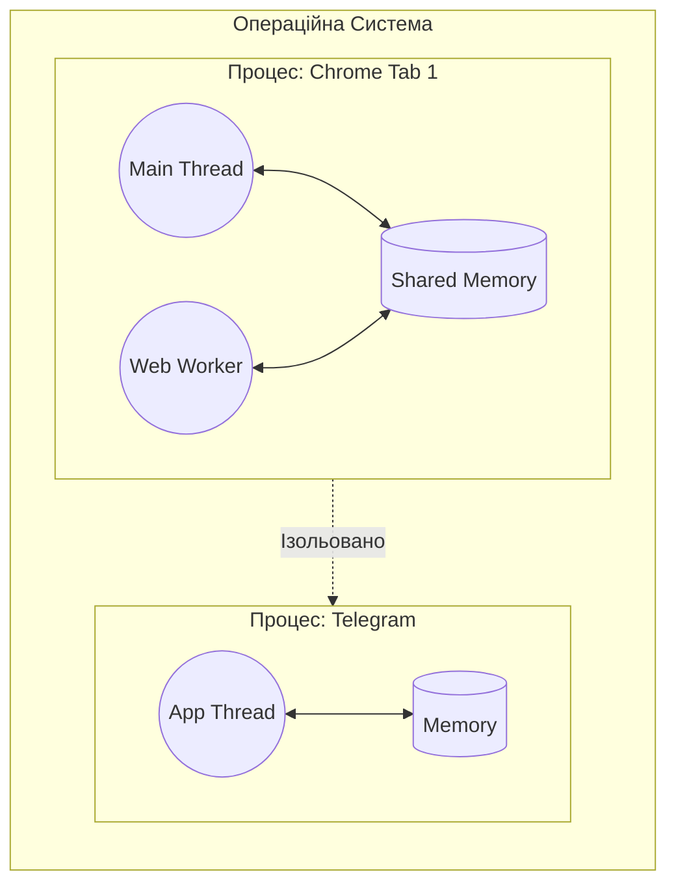
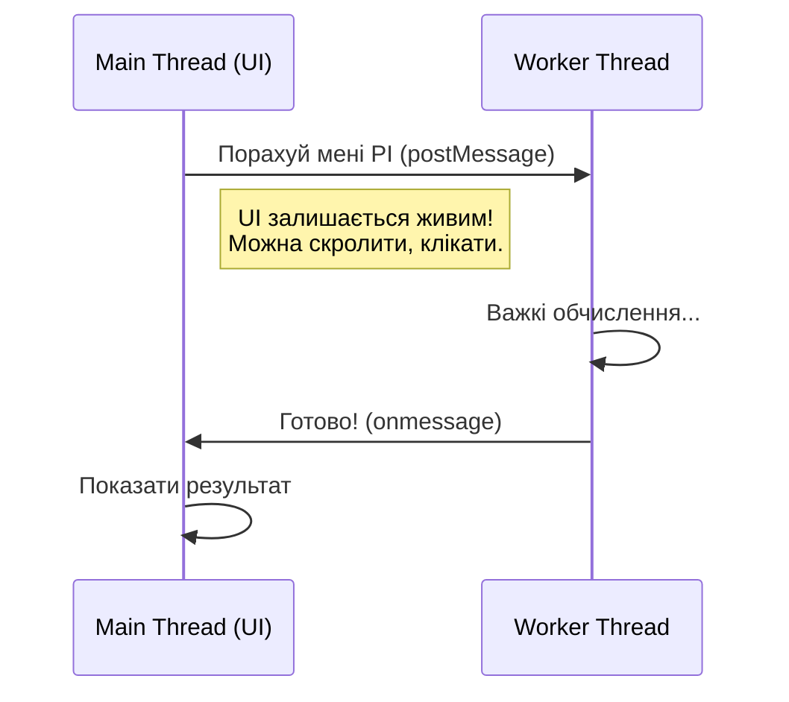

# Лекція 3.5: Роль ОС у роботі браузера. Процеси, Потоки та Контекст виконання

Перед тим, як лізти в "кишки" браузера, треба зрозуміти середовище, в якому він живе.
Ваш браузер — це не магія. Це звичайна програма, яка підкоряється законам Операційної Системи (Windows, macOS, Linux).

---

## Експрес-опитування: Процеси

**Питання:** Що станеться, якщо ви закриєте вкладку YouTube у Chrome?

A) Закриється весь браузер  
B) Закриється тільки ця вкладка, інші продовжать працювати  
C) Залежить від налаштувань

Відповідь

**B**. Кожна вкладка Chrome — це окремий **Процес (Process)**. Операційна Система ізолює їх один від одного. Коли ви закриваєте вкладку, ОС видаляє тільки цей процес, звільняє його пам'ять (RAM), а інші процеси працюють далі.

Це називається **Multi-process Architecture**. Це чому:
- Зависла вкладка не кладе весь браузер
- Зловмисний скрипт на одній вкладці не може вкрасти дані з іншої

---

## 1. Операційна Система (The Manager)

Уявіть, що ваш комп'ютер — це величезний завод.
* **CPU (Процесор):** Це верстати і робітники.
* **RAM (Пам'ять):** це робочі столи і склади.
* **OS (Операційна Система):** Це **Менеджер заводу**.

Менеджер (ОС) вирішує:
1.  Кому дати доступ до верстата (CPU Scheduling).
2.  Скільки столів (RAM) виділити кожному відділу.
3.  Щоб один відділ не крав деталі в іншого (Memory Protection).

---

## 2. Процес (Process) — Це "Заводський Цех"

Коли ви запускаєте програму (наприклад, Telegram або Chrome), ОС створює для неї **Процес**.

**Характеристики Процесу:**
1.  **Ізоляція:** Це окрема кімната з зачиненими дверима. Процес А не бачить пам'яті Процесу Б.
2.  **Ресурси:** ОС виділяє йому шматок RAM. Якщо процес зависне або впаде, ОС просто "спалить" цю кімнату і звільнить ресурси. Інші кімнати не постраждають.
3.  **Важкість:** Створення процесу — це дорого (треба виділити пам'ять, зареєструвати в системі).

> **В браузері:** Кожна вкладка Chrome — це (зазвичай) окремий процес. Тому, коли падає одна вкладка, весь браузер не закривається. Це називається **Multi-process Architecture**.

---

## 3. Потік (Thread) — Це "Робітник у цеху"

Усередині Процесу (кімнати) працюють люди. Це **Потоки**.

**Характеристики Потоку:**
1.  **Спільна пам'ять:** Всі потоки одного процесу бачать одні й ті самі змінні (живуть в одній кімнаті).
2.  **Легкість:** Створити потік швидко і дешево.
3.  **Небезпека:** Якщо один потік зробить помилку (наприклад, нескінченний цикл або помилка пам'яті), він може "підірвати" весь цех (весь Процес впаде).

### Візуалізація:

-----

## 4\. Контекст перемикання (Context Switching)

У вас 8 ядер у процесорі, але запущено 100 програм. Як це можливо?
ОС обманює вас. Вона робить **Context Switching**.

1.  ОС каже Процесу А: "Працюй\!"
2.  Процес А працює 20 мілісекунд.
3.  ОС каже: "Стоп\! Замри\!" (Зберігає стан регістрів).
4.  ОС каже Процесу Б: "Працюй\!"
5.  Процес Б працює 20 мілісекунд.

Це відбувається тисячі разів на секунду. Вам здається, що все працює одночасно (Parallelism), але насправді це швидке перемикання (Concurrency).

> **Інсайт для JS:** JavaScript (у браузері) працює в **Одному Потоці** (Main Thread). Якщо цей потік "задумається" на 5 секунд, ОС не зможе змусити його оновити інтерфейс. Вікно побіліє, і ОС запропонує "Вбити процес".

-----

## 5\. До чого тут Web Workers?

Ми розглянемо приклад з `calculatePI` (обчислення числа π методом Монте-Карло) і зависанням інтерфейсу.

  * **Звичайний JS:** Ви вантажите Main Thread. Інтерфейс висить.
  * **Web Worker:** Ви просите браузер (Процес) створити **новий Потік** (Worker Thread) паралельно до головного.

<!-- end list -->

**Нюанс:** Оскільки потоки в JS (історично) ізольовані заради безпеки, вони не мають спільної пам'яті (як у C++). Вони спілкуються через повідомлення (copying data). Це повільніше, але безпечніше.

-----

## Практикум: "Диспетчер завдань"

1.  Відкрийте Chrome. Відкрийте 3-4 важкі вкладки (YouTube, Rozetka, Figma).
2.  Натисніть `Shift + Esc` (в Chrome). Це **Вбудований Диспетчер Завдань браузера**.
3.  Подивіться:
      * Кожна вкладка — це окремий рядок (Process ID).
      * У кожного свій `Memory Footprint` і `CPU`.
4.  **Експеримент:** Виберіть процес однієї вкладки і натисніть "End Process".
      * Вкладка покаже "Aw, Snap\!" (Опаньки\!), але сам браузер не закриється.
      * Це і є ізоляція процесів у дії.

## Контрольні питання

1.  Чому JS називають "однопоточним", якщо браузер створює купу потоків?
2.  Що швидше: передати дані між двома потоками (Threads) чи між двома процесами (Processes)?
3.  Чому браузери перейшли від архітектури "Один процес на все" до "Процес на вкладку"?

Відповіді

1.  Тому що ваш код (бізнес-логіка) виконується лише в **одному** Main Thread. Інші потоки (мережеві, GPU) — це службові помічники, ви не керуєте ними напряму.
2.  Між потоками швидше (спільна пам'ять). Між процесами треба використовувати IPC (Inter-Process Communication), що набагато повільніше.
3.  **Стабільність і Безпека.** Щоб одна "важка" вкладка або вірус не поклали весь браузер і не вкрали дані з сусідньої вкладки (банку).

