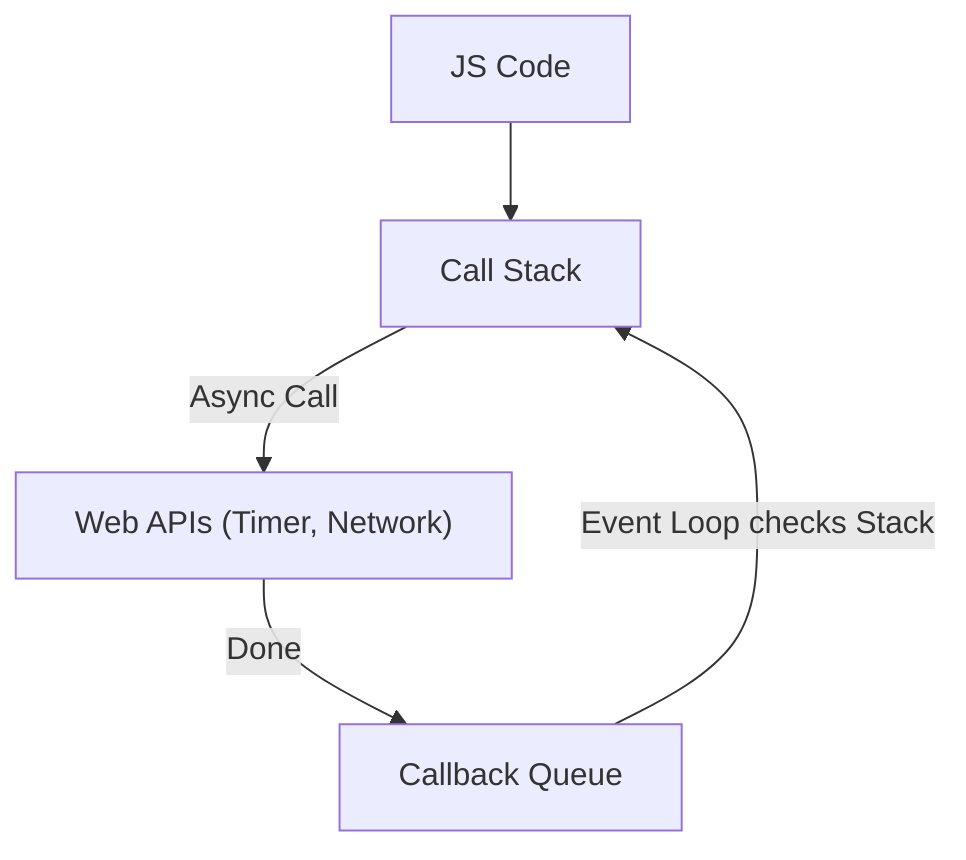

# Лекція 4: Браузер зсередини. Event Loop та Rendering

## Експрес-опитування: Відчуття часу

1.  Скільки мілісекунд у вас є, щоб відмалювати один кадр анімації, щоб вона була плавною (60 FPS)?
2.  Ви запустили цикл `while(true)`. Чому ви не можете закрити вкладку браузера, натиснувши на хрестик?
3.  Чому Chrome створює так багато процесів у Диспетчері завдань, навіть якщо відкрита одна вкладка?

<details markdown="1">
<summary>Відповіді інженера</summary>

1.  **16.6 мс** (1000 мс / 60 кадрів). Якщо ваш код виконується довше — інтерфейс "лагає" (Jank).
2.  **Main Thread Blocked.** Обробка натискання на хрестик і виконання вашого циклу відбуваються в *одному* потоці. Поки він зайнятий циклом, він не чує мишку.
3.  **Multi-process Architecture.** Chrome ізолює вкладки (Renderer Process), плагіни та GPU в окремі процеси. Якщо одна вкладка впаде, браузер виживе .

</details>

---

## 1. Архітектура: Процеси та Потоки

Більшість людей думає, що браузер — це одна програма.
Інженер знає, що це **Операційна Система в мініатюрі**.

### Chrome Multi-process Architecture
Коли ви запускаєте Chrome, він запускає цілу армію процесів :

1.  **Browser Process:** "Бос". Керує вікном, адресним рядком, закладками та мережевими запитами.
2.  **Renderer Process:** "Робітник". Відповідає за **одну вкладку**. Парсить HTML, виконує JS, малює пікселі.
3.  **GPU Process:** Малює графіку на відеокарті.
4.  **Plugin Process:** Ізолює Flash (R.I.P.) та інші плагіни.

> **Інсайт:** Чому Chrome "жере" пам'ять? Бо кожна вкладка — це окремий процес зі своєю пам'яттю.
> **Плюс:** Якщо сайт `bad-code.com` зависне, ваша вкладка з YouTube продовжить грати музику. Це називається **Fault Isolation**.

---

## 2. Main Thread: Вузьке горлечко

Усередині Renderer Process є **Main Thread** (Головний Потік). Це найважливіший працівник.
Він робить **ВСЕ** :
1.  Парсить HTML -> DOM.
2.  Рахує стилі (CSSOM).
3.  Виконує ваш JavaScript.
4.  Розраховує макет (Layout).
5.  Малює пікселі (Paint).

**Проблема:** Він **один**.
Якщо ви напишете в JS:
```javascript
// Важкі обчислення на 5 секунд
const start = Date.now();
while (Date.now() - start < 5000) {}
```

...то Main Thread буде зайнятий 5 секунд. Він **не зможе** перемалювати екран. Користувач побачить "завислий" інтерфейс.

-----

## 3\. Event Loop: Як робити все одразу?

Якщо JS однопотоковий, як тоді працюють `setTimeout`, кліки та запити до сервера, не блокуючи інтерфейс?

Секрет у **Event Loop (Цикл подій)** .

### Механіка:

1.  **Call Stack (Стек викликів):** Тут виконується синхронний код.
2.  **Web APIs:** Браузер бере на себе важку роботу (таймери, мережа). Коли таймер спрацьовує, браузер кидає callback у чергу.
3.  **Queue (Черга завдань):** Тут чекають колбеки (`onClick`, `onLoad`, `setTimeout`).
4.  **Event Loop:** Це нескінченний цикл, який робить одну просту річ:
      * *"Стек пустий? Якщо так — візьми першу задачу з черги і кинь у стек"*.

### Візуалізація:



-----

## 4\. Rendering Pipeline: Шлях пікселя

Як код перетворюється на картинку? Це конвеєр (Pipeline) :

1.  **DOM + CSSOM = Render Tree.** Браузер відкидає все невидиме (`display: none`, `<head>`).
2.  **Layout (Reflow):** Геометрія. Де знаходиться кожен елемент (x, y, width, height).
3.  **Paint:** Заповнення пікселів (колір, текст, тіні).
4.  **Composite:** Складання шарів (Layers) в одну картинку.

### Layout Thrashing (Вбивство продуктивності)

Якщо ви в циклі JS змінюєте стиль і одразу читаєте його розмір, ви змушуєте браузер перераховувати Layout сотні разів на секунду.

```javascript
// ❌ ПОГАНО
for (let i = 0; i < 100; i++) {
    box.style.width = i + 'px'; // Invalidate Layout
    console.log(box.offsetWidth); // Force Layout (Браузер мусить порахувати прямо зараз!)
}
```

-----

## 5\. `requestAnimationFrame` vs `setInterval`

Ми робили гру Pong. Чому ми використовували `requestAnimationFrame`? .

  * `setInterval(fn, 16)`: "Запусти функцію через 16мс". Браузеру байдуже, чи готовий він малювати. Він може запустити її посеред рендерингу. Це викликає **Jank** (смикання).
  * `requestAnimationFrame(fn)`: "Запусти функцію **перед наступним кадром**". Браузер синхронізує ваш код з частотою оновлення монітора (V-Sync).

-----

## Практикум: "Заморожування часу"

Ми повертаємося до прикладу з числом Pi (`ws02_monte_carlo.md`).

1.  Запустіть код з 10 млн точок.
2.  Відкрийте вкладку **Performance** у DevTools.
3.  Запишіть профіль (Record).
4.  Подивіться на графік. Ви побачите величезний жовтий блок **"Scripting"**, який займає весь час. А під ним — червона лінія "Long Task".
5.  В цей час **FPS = 0**.

**Завдання:**
Це підготовка до воркшопу з оптимізації. Ми навчимося розбивати це завдання на шматки, щоб дати Event Loop-у "подихати".

-----

## Контрольні питання

1.  В чому різниця між `Process` і `Thread` у контексті Chrome?
2.  Який етап рендерингу (Layout чи Paint) є більш "дорогим" для браузера?
3.  Що станеться, якщо у `setTimeout(fn, 0)` передати 0 затримку? Функція виконається миттєво чи ні?

<details markdown="1">
<summary>Відповіді</summary>

1.  **Process** має свою виділену пам'ять. Якщо він падає, інші процеси живуть. **Thread** живе всередині процесу і ділить з ним пам'ять.
2.  **Layout.** Він вимагає перерахунку геометрії всього документа (або його частини), що впливає на сусідів. Paint — це просто зафарбовування пікселів.
3.  **Не миттєво.** Вона потрапить у кінець Черги Завдань (Queue). Вона виконається тільки **після** того, як Стек очиститься від поточного синхронного коду.

</details>