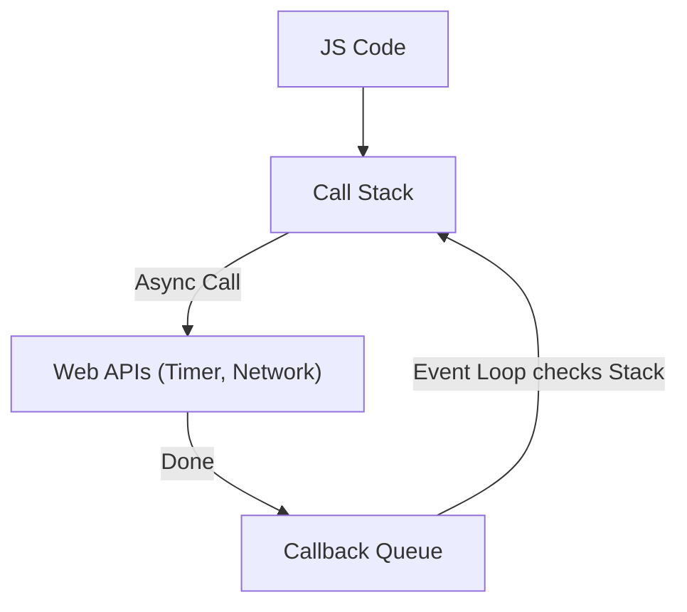
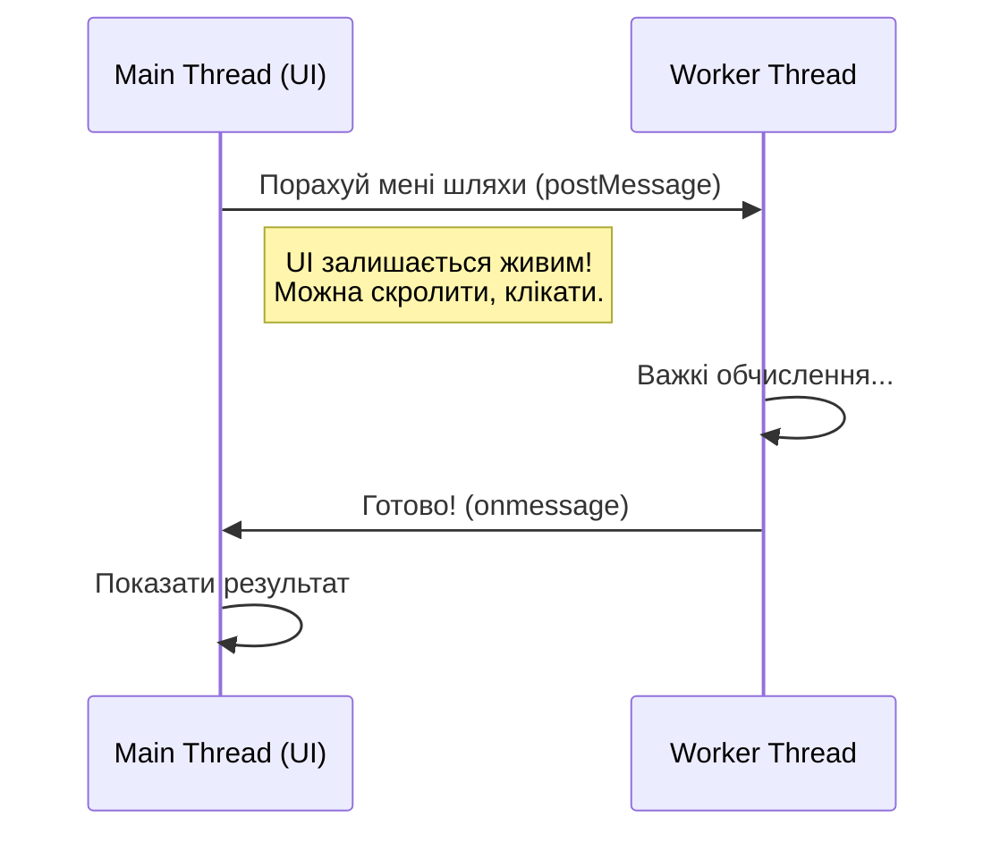

# Лекція 4: Браузер зсередини. Event Loop та Rendering

## Міні-план: як читати цю лекцію

У [Лекції 01b](01b_html_dom.md) та [Лекції 02](02_css_layout.md) ви вже бачили, як браузер перетворює HTML → DOM → Render Tree → пікселі. Тут ми йдемо **глибше**: як ОС керує процесами, чому JS однопотоковий, і який саме механізм дозволяє йому бути «живим» — **Event Loop**.

| Опора | Про що | Де знадобиться |
|--------|--------|----------------|
| **Процеси та Потоки (нагадування)** | Браузер = набір ізольованих процесів; ваш JS живе в одному потоці | Зрозуміти, чому `while(true)` вбиває UI |
| **Context Switching** | ОС перемикає процеси тисячі разів/сек, створюючи ілюзію паралельності | Пояснює «одночасну» роботу 100 програм на 8 ядрах |
| **Event Loop** | Цикл, що бере задачі з черги, коли стек пустий | Ключ до розуміння `setTimeout`, callbacks, анімацій |
| **Rendering Pipeline (нагадування)** | DOM → Style → Layout → Paint → Composite | Пояснює, чому `transform` дешевший за `width` |
| **rAF vs setInterval** | Синхронізація з монітором замість «сліпого» таймера | Плавні 60 FPS анімації у HiveMind |
| **Web Workers** | Окремий потік для важких обчислень | Pathfinding 10 000 мурах без зависання UI |

---

## Експрес-опитування: Відчуття часу

1.  Скільки мілісекунд у вас є, щоб відмалювати один кадр анімації, щоб вона була плавною (60 FPS)?
2.  Ви запустили цикл `while(true)`. Чому ви не можете закрити вкладку браузера, натиснувши на хрестик?
3.  У вас 8 ядер CPU, але запущено 100 програм. Як це можливо?

<details markdown="1">
<summary>Відповіді інженера</summary>

1.  **16.6 мс** (1000 мс / 60 кадрів). Якщо ваш код виконується довше — інтерфейс "лагає" (Jank).
2.  **Main Thread Blocked.** Обробка натискання на хрестик і виконання вашого циклу відбуваються в *одному* потоці. Поки він зайнятий циклом, він не чує мишку.
3.  **Context Switching.** ОС швидко перемикає процеси (тисячі разів/сек), створюючи ілюзію одночасної роботи. Це **Concurrency**, а не справжня **Parallelism**.

</details>

---

## 1. Нагадування: Процеси, Потоки та ОС

> *Детально ви бачили це в [Лекції 01b](01b_html_dom.md). Тут — стислий повтор, щоб тримати в голові під час вивчення Event Loop.*

### ОС як менеджер заводу

* **CPU** — верстати (обчислення).
* **RAM** — робочі столи (пам'ять).
* **ОС** — менеджер, який вирішує: кому дати CPU, скільки RAM виділити, і щоб один процес не крав дані іншого.

### Процес = ізольований цех

Кожна програма (Chrome, Telegram) отримує свій процес з **окремою пам'яттю**. Якщо один впаде — інші виживуть.

**Chrome:** кожна вкладка — (зазвичай) окремий процес. Тому «Aw, Snap!» однієї вкладки не вбиває YouTube в іншій.

### Потік = робітник у цеху

Усередині процесу працюють потоки. Вони **ділять спільну пам'ять** (швидко, але небезпечно — один може зламати все).

**У Renderer Process Chrome:**

| Потік | За що відповідає |
|---|---|
| **Main Thread** | Парсинг HTML, CSS, виконання JS, Layout, Paint |
| **Compositor Thread** | Склейка шарів, скрол (працює навіть коли Main Thread зависає) |

> **Критична думка:** Ваш JS живе в **одному** Main Thread. Заблокуєте його — замерзне весь UI.

### Context Switching: ілюзія багатозадачності

У вас 8 ядер, а відкрито 100 процесів. ОС обманює:

1. Процес А працює ~20 мс → ОС зберігає його стан (регістри) → 
2. Процес Б працює ~20 мс → ОС зберігає → 
3. Повертається до А...

Тисячі перемикань на секунду створюють ілюзію паралельності. Це **Concurrency** (конкуренція за час CPU), а не **Parallelism** (справжня одночасна робота на різних ядрах).

> **Інсайт для JS:** Якщо Main Thread «задумається» на 5 секунд — ОС не може змусити його оновити інтерфейс. Вікно побіліє, і ОС запропонує «Вбити процес».

---

## 2. Event Loop: Як робити все одразу?

Якщо JS однопотоковий, як тоді працюють `setTimeout`, кліки та запити до сервера, не блокуючи інтерфейс?

Секрет у **Event Loop (Цикл подій)**.

### Механіка:

1.  **Call Stack (Стек викликів):** Тут виконується синхронний код.
2.  **Web APIs:** Браузер бере на себе важку роботу (таймери, мережа). Коли таймер спрацьовує, браузер кидає callback у чергу.
3.  **Queue (Черга завдань):** Тут чекають колбеки (`onClick`, `onLoad`, `setTimeout`).
4.  **Event Loop:** Це нескінченний цикл, який робить одну просту річ:
      * *"Стек пустий? Якщо так — візьми першу задачу з черги і кинь у стек"*.

### Візуалізація:


```mermaid
graph TD;
    JS_Code[JS Code] --> Stack[Call Stack];
    Stack -->|Async Call| WebAPI["Web APIs (Timer, Network)"];
    WebAPI -->|Done| Queue[Callback Queue];
    Queue -->|Event Loop checks Stack| Stack;
```

### 🤔 Давайте поміркуємо: `setTimeout(fn, 0)`

Що виведе цей код?

```javascript
console.log("1");
setTimeout(() => console.log("2"), 0);
console.log("3");
```

<details markdown="1">
<summary>Відповідь</summary>

**1, 3, 2.** Навіть з затримкою 0 мс, `setTimeout` — це **асинхронний виклик**. 

Детальний розбір того, що відбувається з рядком `setTimeout(() => console.log("2"), 0);`:
1. Під час читання коду створюється **лямбда-функція** (стрілочна анонімна функція `() => console.log("2")`). По суті, це об'єкт в пам'яті, який зберігає інструкцію для майбутнього виконання.
2. `setTimeout` передає цю функцію до браузерного Web API і просить запустити таймер на 0 мс.
3. Щойно таймер спрацьовує (в даному випадку одразу), Web API відправляє нашу створену лямбда-функцію (об'єкт-callback) у **чергу очікування завдань** (Callback Queue / Task Queue).
4. Функція чекає у цій черзі, доки виконується синхронний код (`console.log("3")`).
5. Програма (Event Loop) постійно перевіряє основний потік (Call Stack). Тільки тоді, коли він повністю очиститься, Event Loop бере нашу функцію з черги і запускає (виконує) її, і ми бачимо в консолі `"2"`.

</details>

### Функції в JS: Звичайна vs Анонімна vs Лямбда

Звідки беруться ці функції та як вони існують з точки зору пам'яті і рушія JS:

| Тип | Синтаксис | Де і як зберігається об'єкт функції? | Особливості та походження |
| :--- | :--- | :--- | :--- |
| **Звичайна (Function Declaration)** | `function foo() {}` | **На етапі парсингу** файлу/скрипта (Hoisting). Зберігається як іменований об'єкт в пам'яті і доступна будь-де у своїй області видимості. | Має власний контекст `this` та `arguments`. Класичний підхід для багаторазового структурного використання. |
| **Анонімна (Function Expression)** | `const f = function() {}`<br>або `setTimeout(function() {}, 0)` | **Під час виконання рядка** коду. Створюється об'єкт функції в купі (Heap), який передається як аргумент (callback) або присвоюється змінній. | Також має свій `this`. Використовується, коли логіка потрібна "тут і зараз" і немає сенсу вигадувати ім'я чи засмічувати область видимості. |
| **Лямбда (Arrow Function)** | `const f = () => {}`<br>або `setTimeout(() => {}, 0)` | **Під час виконання рядка**. Створюється в пам'яті як легковажний об'єкт-замикання в момент визначення. | Термін прийшов з **функціонального програмування** (лямбда-числення), де функції — це математичні вирази, значення-"першого класу" для маніпуляцій. В JS її фішка в тому, що вона **не має власного `this`** (бере його з оточення створення — в даному випадку це глобальний простір основного потоку), тому не губить контекст у колбеках Event Loop. |

-----

## 3. Rendering Pipeline: нагадування

> *Повний розбір — у [Лекції 01b, розділ 5](01b_html_dom.md). Тут — стисла версія для контексту.*

```
DOM + CSSOM → Render Tree → Layout → Paint → Composite
```

* **Layout (Reflow)** — найдорожчий етап. Зміна `width`, `height`, `margin` перераховує **геометрію всіх сусідів**.
* **Composite** — найдешевший. Зміна `transform` та `opacity` працює тільки на GPU.

🚀 **Правило для HiveMind:** анімуйте мурах через `transform: translate()`, а не `top/left`.

### Layout Thrashing (антипатерн)

```javascript
// ❌ ПОГАНО: читання + запис у циклі = N перерахунків Layout
for (let i = 0; i < 100; i++) {
    box.style.width = i + 'px';       // Invalidate Layout
    console.log(box.offsetWidth);     // Force Layout (прямо зараз!)
}
```
> ⚠️ **Що тут відбувається:** Тобто кожна така зміна не лише змушує браузер рахувати Layout 100 разів *замість одного*, а й в кінцевому підсумку призводить до того, що **Paint та Composite** будуть виконуватися заново для всього оновленого дерева. Це "вбиває" плавний рендеринг.


-----

## 4. `requestAnimationFrame` vs `setInterval`

### ❌ Чому `setInterval` погано підходить для анімацій?
Коли ви використовуєте `setInterval(fn, 16)`, ви просите браузер: *"кидай мій колбек у чергу кожні 16 мілісекунд"*. 
Але Event Loop та Rendering Pipeline живуть за власними правилами, тому виникають проблеми:
1. **Сліпота до екрану:** таймеру абсолютно байдуже, чи готовий зараз браузер малювати новий кадр. Він може змінити DOM *одразу після того*, як браузер намалював поточний кадр, або безпосередньо в процесі рендерингу.
2. **Пропуски кадрів:** якщо Call Stack зайнятий, колбеки `setInterval` не викликнуться вчасно. Вони або відкладуться, або виконаються по кілька штук поспіль. Результат — візуальне смикання (**Jank**).
3. **Витрата батареї:** таймер працюватиме невпинно, навіть якщо вкладка браузера згорнута або перекрита іншим вікном. Це вхолосту витрачає ресурси CPU.

### ✅ Чому `requestAnimationFrame` — це стандарт?
Коли ви викликаєте `requestAnimationFrame(fn)` (або коротко **rAF**), ви просите браузер: *"виконай цю функцію рівно тоді, коли ти будеш **готовий почати** малювати наступний кадр"*.
1. **Синхронізація з монітором (V-Sync):** rAF глибоко інтегрований у Rendering Pipeline. Він виконається *безпосередньо перед* розрахунком Layout і Paint. Якщо монітор працює на частоті 60 Гц, rAF викликатиметься ~60 разів на секунду, підлаштовуючись під ідеальну гладкість на конкретному екрані (навіть для 144 Гц).
2. **Гарантія плавності:** оскільки оновлення даних та рендеринг відбуваються в узгоджений з браузером момент, ми уникаємо "розірваних" (Tearing) або пропущених кадрів.
3. **Оптимізація (Battery Friendly):** якщо користувач переключиться на іншу вкладку, браузер **автоматично припинить викликати rAF**. Ваша фізика чи анімація стане на паузу, заощаджуючи заряд батареї ноутбука.

> У HiveMind ігровий цикл повинен бути на `requestAnimationFrame`, а не на `setInterval`.

-----

## 5. Web Workers: коли Main Thread не справляється

Якщо ваш код вважає pathfinding для 10 000 мурах — це 5+ секунд обчислень. Main Thread буде зайнятий, UI замерзне.

**Рішення:** попросити браузер створити **окремий потік** (Worker):


```mermaid
sequenceDiagram
    participant Main as Main Thread (UI)
    participant Worker as Worker Thread
    
    Main->>Worker: Порахуй мені шляхи (postMessage)
    Note right of Main: UI залишається живим!<br>Можна скролити, клікати.
    Worker->>Worker: Важкі обчислення...
    Worker->>Main: Готово! (onmessage)
    Main->>Main: Показати результат
```

### 🔀 Архітектурний нюанс: JS Worker vs C++ Thread

Якщо ви писали багатопотоковий код на C++ (наприклад, використовуючи `std::thread`), ви звикли, що потоки ділять один спільний простір пам'яті. У JavaScript підхід кардинально інший: **Workers у JS повністю ізольовані і не мають спільної пам'яті**. 

Вони спілкуються між собою виключно розсилаючи **повідомлення** (`postMessage`). Що це означає на практиці:

1. **Передача за значенням (Копіювання у Heap):** Коли ви надсилаєте об'єкт з Main Thread до Worker'а (або навпаки), браузер використовує алгоритм *Structured Clone*. Він створює **нову, незалежну копію** цього об'єкта в купі (Heap) того потоку, який приймає повідомлення. Ви не передаєте вказівник на оригінал, ви передаєте дублікат.
2. **Жодних Data Races (Станів гонитви):** У C++, якщо два потоки одночасно змінюють одну ділянку пам'яті (одну змінну), ви отримаєте непередбачувану поведінку — **Race Condition**, і вам доводиться блокувати пам'ять м'ютексами (`std::mutex`). Оскільки в JS потоки фізично не можуть торкнутися пам'яті один одного, **data races неможливі за визначенням**. Вам непотрібно писати локи (locks).
3. **Плата за ізоляцію:** Створення глибокої копії великого об'єкта займає багато часу. Якщо кожен кадр кидати туди-сюди масив на мільйон комірок, на копіювання піде більше часу, ніж на самі обчислення. (Для таких випадків існує `SharedArrayBuffer`, але це вже складна оптимізація).

-----

## Практикум: «Диспетчер завдань» + «Заморожування часу»

### Частина 1: Побачити процеси Chrome

1.  Відкрийте 3–4 важкі вкладки (YouTube, Rozetka, Figma).
2.  Натисніть **Shift + Esc** — відкриється вбудований Диспетчер Завдань Chrome.
3.  Кожна вкладка — окремий рядок з `Memory Footprint` та `CPU`.
4.  **Експеримент:** виберіть процес однієї вкладки → «End Process» → побачите «Aw, Snap!», але решта браузера живе.

### Частина 2: Побачити Event Loop у DevTools

1.  Відкрийте вкладку **Performance** у DevTools.
2.  Запустіть «важкий» JS-код і запишіть профіль (Record).
3.  Знайдіть жовтий блок **«Scripting»** і червону лінію **«Long Task»**.
4.  У цей час **FPS = 0** — Event Loop не встиг «подихнути».

-----

## Контрольні питання

1.  Чому JS називають «однопоточним», якщо браузер створює купу потоків?
2.  В чому різниця між `Process` і `Thread` у контексті Chrome?
3.  Який етап рендерингу (Layout чи Composite) є більш «дорогим» для браузера?
4.  Що станеться, якщо у `setTimeout(fn, 0)` передати 0 затримку? Функція виконається миттєво?
5.  Чому для анімацій `requestAnimationFrame` краще за `setInterval`?

<details markdown="1">
<summary>Відповіді</summary>

1.  Ваш бізнес-код виконується лише в **одному** Main Thread. Інші потоки (мережеві, GPU, compositor) — службові; ви не керуєте ними напряму з JS.
2.  **Process** має виділену пам'ять. Падає — інші живуть. **Thread** живе всередині процесу і ділить з ним пам'ять.
3.  **Layout.** Він вимагає перерахунку геометрії всього документа (або частини). Composite — це просто склейка шарів на GPU.
4.  **Не миттєво.** Callback потрапить у Queue. Він виконається тільки після того, як Call Stack очиститься від поточного синхронного коду.
5.  `setInterval` не синхронізується з частотою оновлення монітора — може запустити callback посеред рендерингу, що викликає jank. `rAF` гарантує виклик **перед** наступним кадром і автоматично зупиняється для прихованих вкладок.

</details>