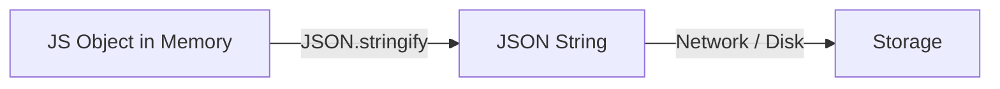

# Лекція 5: JSON. Мова, якою спілкується світ

## ⚡ Експрес-опитування: Чи є це валідним JSON?

1.  `{ name: "Vitaliy" }`
2.  `{ "name": 'Vitaliy' }`
3.  `{ "score": 100, }` (з комою в кінці)
4.  `{ "method": function() { alert(1) } }`

<details markdown="1">
<summary>Відповіді</summary>

1.  **Ні.** Ключі *обов'язково* мають бути в подвійних лапках.
2.  **Ні.** JSON визнає тільки **подвійні** лапки `"`.
3.  **Ні.** Trailing comma (кома в кінці) заборонена в чистому JSON.
4.  **Ні.** JSON — це дані. Функції — це код. JSON не може зберігати код (і це добре для безпеки).

</details>

---

## 1. Що таке JSON?

**JSON (JavaScript Object Notation)** — це текстовий формат обміну даними.
Хоча в назві є слово JavaScript, зараз це стандарт для **всіх** мов програмування (Python, Java, C++, Go).

### Інженерний погляд:
У пам'яті комп'ютера (Heap) об'єкт — це складна структура з посиланнями.
Щоб передати цей об'єкт по мережі або зберегти у файл, нам треба перетворити його на **Рядок (String)**.
Цей процес називається **Серіалізація**.



-----

## 2\. Синтаксис: Суворість закону

На відміну від JS об'єктів, JSON не пробачає помилок .

  * **Ключі:** Тільки `"key"`.
  * **Значення:**
      * Рядки `"string"`
      * Числа `10`, `3.14`
      * Булеві `true`, `false`
      * `null`
      * Масиви `[]`
      * Об'єкти `{}`
  * **Заборонено:**
      * `undefined`
      * Функції
      * Коментарі `//` (JSON — це дані, а не код) .

-----

## 3\. JSON vs XML: Чому XML програв?

Раніше (у 90-х та 00-х) стандартом був **XML** .

**Порівняння:**

**XML:**

```xml
<user>
  <id>1</id>
  <name>Vitaliy</name>
</user>
```

**JSON:**

```json
{
  "id": 1,
  "name": "Vitaliy"
}
```

**Чому переміг JSON?** 

1.  **Розмір:** Менше символів (немає закриваючих тегів). Економія трафіку.
2.  **Парсинг:** У JavaScript JSON перетворюється на об'єкт однією командою. Для XML потрібен громіздкий `DOMParser` .
3.  **Читабельність:** JSON легше сприймається оком розробника.

> **Де залишився XML?**
>
>   * `sitemap.xml` (для Google).
>   * RSS стрічки.
>   * Старі банківські системи (SOAP).
>   * SVG картинки (це теж XML\!).

-----

## 4\. Робота в JavaScript

У нас є два головні методи :

### `JSON.stringify(obj)`

Перетворює об'єкт на рядок.

```javascript
const user = { name: "Alex", level: 5 };
const data = JSON.stringify(user); 
// Результат: '{"name":"Alex","level":5}'
```

### `JSON.parse(string)`

Перетворює рядок назад на об'єкт.

```javascript
const obj = JSON.parse(data);
console.log(obj.name); // "Alex"
```

### ⚠️ Інженерна небезпека

`JSON.parse()` — це небезпечна операція. Якщо рядок битий, скрипт **впаде** з помилкою (`SyntaxError`), і ваша гра зламається.

**Правильний патерн:**

```javascript
try {
    const data = JSON.parse(serverData);
} catch (e) {
    console.error("Дані пошкоджено!", e);
    // Використати дефолтні налаштування
}
```

-----

## 5\. LocalStorage: Кишеня браузера

Ми хочемо, щоб наша гра пам'ятала прогрес.
Браузер має сховище **LocalStorage**. Воно живе вічно (поки не почистиш кеш) .

**Обмеження:** `localStorage` вміє зберігати **тільки рядки**.
Ви не можете зберегти там об'єкт.

**Як зберегти гру:**

1.  Беремо об'єкт `gameState`.
2.  `JSON.stringify(gameState)`.
3.  `localStorage.setItem('save', string)`.

**Як завантажити гру:**

1.  `localStorage.getItem('save')`.
2.  `JSON.parse(string)`.

-----

## 🛠 Практикум: "Злам збереження"

1.  Відкрийте будь-який сайт, де у вас є налаштування (наприклад, темна тема).
2.  Відкрийте **DevTools -\> Application -\> Local Storage**.
3.  Ви побачите пари Ключ-Значення.
4.  Спробуйте змінити значення вручну. Оновіть сторінку.
      * *Сайт зламався? Чи прийняв ваші зміни?*

## 🏠 Домашнє завдання

Реалізуйте **збереження рекорду** у вашій грі (Pong або Bad UI).

1.  При зміні очок зберігайте їх у `localStorage`.
2.  При завантаженні сторінки (`window.onload`) читайте значення і відновлюйте рахунок.
3.  **Бонус:** Зробіть кнопку "Reset Score", яка очищає пам'ять.