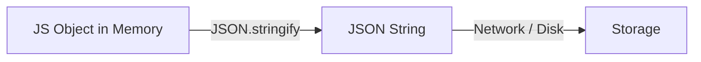

# Лекція 5: JSON. Мова, якою спілкується світ

## Проблемне питання на старті

Уявіть, що ви написали гру на JavaScript, і хочете зберегти прогрес гравця: `const player = { name: "Alex", score: 100 }`.
Ви хочете відправити ці дані на сервер, який написаний на Python, Java або C++. 
Але є проблема: ці мови **не знають**, що таке JavaScript-об'єкт. Вони мають власні, зовсім інші структури даних у пам'яті.

**Питання:** Як передати дані так, щоб їх зрозуміла будь-яка мова програмування на будь-якому комп'ютері у світі?

<details markdown="1">
<summary>Відповідь</summary>

Потрібно перетворити об'єкт на звичайний **текст (рядок)** за суворими універсальними правилами, які знають всі.
Саме цим універсальним текстовим форматом і є **JSON**.

</details>

---

## 1. Що таке JSON?

**JSON (JavaScript Object Notation)** — це текстовий формат обміну даними.
Хоча в назві є слово JavaScript, зараз це стандарт для **всіх** мов програмування (Python, Java, C++, Go).

### Інженерний погляд:
У пам'яті комп'ютера (Heap) об'єкт — це складна структура з посиланнями.
Щоб передати цей об'єкт по мережі або зберегти у файл, нам треба перетворити його на **Рядок (String)**.
Цей процес називається **Серіалізація**.


```mermaid
graph LR;
    Heap[JS Object in Memory] -->|JSON.stringify| String[JSON String];
    String -->|Network / Disk| Storage;
```

-----

## 2\. Синтаксис: Суворість закону

На відміну від JS об'єктів, JSON не пробачає помилок .

  * **Ключі:** Тільки `"key"`.
  * **Значення:**
      * Рядки `"string"`
      * Числа `10`, `3.14`
      * Булеві `true`, `false`
      * `null`
      * Масиви `[]`
      * Об'єкти `{}`
  * **Заборонено:**
      * `undefined`
      * Функції
      * Коментарі `//` (JSON — це дані, а не код) .

-----

## 3\. JSON vs XML: Чому XML програв?

Раніше (у 90-х та 00-х) стандартом був **XML** .

**Порівняння:** один і той самий «користувач» у двох форматах.

### XML

```xml
<user>
  <id>1</id>
  <name>Vitaliy</name>
</user>
```

### JSON

```json
{"id": 1, "name": "Vitaliy"}
```

*У файлах і відповідях API часто роблять багаторядковий вигляд — синтаксис той самий, головне дотримуватися правил JSON (подвійні лапки, без коми після останнього поля).*

### Порівняння з синтаксисом JS-об’єкта (не плутати з JSON-текстом)

У **коді** JavaScript той самий зміст часто виглядає так (ключі можна без лапок, якщо це валідні ідентифікатори; рядок у лапках — зазвичай подвійні або одинарні):

```javascript
const user = { id: 1, name: "Vitaliy" };
const asText = JSON.stringify(user); // вже суворий JSON-рядок для мережі/файлу
```

**Відмінності для очей:** JSON — це **завжди текст** з подвійними лапками навколо ключів і рядкових значень; у живому JS-об’єкті лапки навколо ключів часто опускають, а `JSON.stringify` перетворює все на формат, який прийме будь-який парсер JSON.

**Чому переміг JSON?** 

1.  **Розмір:** Менше символів (немає закриваючих тегів). Економія трафіку.
2.  **Парсинг:** У JavaScript JSON перетворюється на об'єкт однією командою. Для XML потрібен громіздкий `DOMParser` .
3.  **Читабельність:** JSON легше сприймається оком розробника.

> **Де залишився XML?**
>
>   * `sitemap.xml` (карта сайту для пошукових роботів Google, щоб вони розуміли структуру ваших сторінок).
>   * RSS стрічки (для підписок на новини).
>   * Корпоративні та банківські системи (SOAP), а також інфраструктура **онлайн-геймінгу** (через високі вимоги до security та жорсткої надійності форматів даних).
>   * SVG картинки (векторна графіка, яка розтягується без втрати якості — під капотом це теж XML\!).

-----

## 4\. Робота в JavaScript

У нас є два головні методи :

### `JSON.stringify(obj)`

Перетворює об'єкт на рядок.

```javascript
const user = { name: "Alex", level: 5 };
const data = JSON.stringify(user); 
// Результат: '{"name":"Alex","level":5}'
```

### `JSON.parse(string)`

Перетворює рядок назад на об'єкт.

```javascript
const obj = JSON.parse(data);
console.log(obj.name); // "Alex"
```

### Інженерна небезпека

`JSON.parse()` — це небезпечна операція. Якщо рядок битий, скрипт **впаде** з помилкою (`SyntaxError`), і ваша гра зламається.

**Правильний патерн:** не давати `JSON.parse` «валити» весь скрипт — обгорнути в `try/catch` і мати **запасний стан**.

```javascript
function loadProfile(raw) {
  const fallback = { name: "Guest", level: 1 };
  try {
    const data = JSON.parse(raw);
    if (typeof data !== "object" || data === null) {
      throw new TypeError("Очікувався об'єкт");
    }
    return { ...fallback, ...data };
  } catch (e) {
    console.error("Невалідний або пошкоджений JSON", e);
    return fallback;
  }
}

// приклад використання
const profile = loadProfile(serverData);
```

-----

## 5\. Еволюція пам'яті браузера: від Cookies до Баз Даних

Історично браузери могли зберігати дані лише в **Cookies**. Але вони мали суттєві недоліки: дуже малий об'єм (всього 4 КБ) та той факт, що вони автоматично відправлялися на сервер із кожним HTTP-запитом. Для збереження прогресу гри або стану великого додатку цього було критично недостатньо.

Тому в сучасних браузерах з'явилися нові інструменти. Сьогодні інженери обирають між двома типами сховищ:

1. **Синхронні сховища (Web Storage API)** — прості у використанні, але блокують основний потік виконання (Main Thread).
   * **SessionStorage:** "маленьке" сховище, яке живе лише доки відкрита вкладка браузера.
   * **LocalStorage:** живе "вічно" (поки користувач або скрипт не почистить кеш). Вміщує близько 5-10 МБ даних.
2. **Асинхронні сховища (IndexedDB)** — велика, повноцінна NoSQL база даних прямо у вашому браузері. Вона дозволяє зберігати сотні мегабайт даних і працює **асинхронно**, тобто не "фрізить" (не заморожує) інтерфейс сторінки під час запису.

> **Як це використовують Facebook та Instagram?**
> Коли ви відкриваєте стрічку Instagram з мобільного або ПК, ви майже миттєво бачите старі пости, лайки та налаштування ще до того, як сервер встигне відповісти. Як? Вони серіалізують величезні JSON-структури минулої сесії і зберігають їх у браузері (часто в IndexedDB або LocalStorage). Спочатку рендериться локальний кеш, і лише потім, у фоні, підтягуються свіжі дані з мережі. Це створює ілюзію миттєвої швидкодії (optimistic UI).

### Наша гра: LocalStorage

Для нашої гри нам не потрібна складна база даних. Ми просто хочемо, щоб вона пам'ятала прогрес. Використаємо найпростіший інструмент — **LocalStorage**.

**Обмеження:** `localStorage` вміє зберігати **тільки рядки**.
Ви не можете зберегти там об'єкт.

**Як зберегти гру:**

1.  Беремо об'єкт `gameState`.
2.  `JSON.stringify(gameState)`.
3.  `localStorage.setItem('save', string)`.

**Як завантажити гру:**

1.  `localStorage.getItem('save')`.
2.  `JSON.parse(string)`.

-----

## Практикум: "Злам збереження"

1.  Відкрийте простий сайт (або невелику гру), де у вас є налаштування (наприклад, темна тема).
2.  Відкрийте **DevTools -\> Application -\> Local Storage**.
3.  Ви побачите прості та зрозумілі пари Ключ-Значення (наприклад, `theme: "dark"`). Спробуйте змінити значення вручну і оновіть сторінку. *Сайт зламався чи прийняв зміни?*
4.  **А тепер відкрийте великий сервіс** (наприклад, Google, Facebook або Instagram). Подивіться їхній LocalStorage. Ви часто побачите щось подібне:
    * **Ключ:** `pse/591286274::[[23,7],"107772415726987348291"]`
    * **Значення:** `CiBbWzIzLDddLCIxMDc3NzI0MTU3MjY5ODczNDgyOTEiXRI7CgcIB9oGAigAEhUxMDc3NzI0MTU3MjY5ODczNDgyOTEYnu5sGJ3ubBin+ZoXGJ7r5hYYydBoGLDd5hYYhNSSxsozIgp0Nmt4MWFoNDd1`

> **Чому так?**
> Великі компанії рідко зберігають дані у відкритому, читабельному JSON-форматі (як `{"score": 100}`). Для економії пам'яті, швидкодії парсингу та захисту від ручного "зламу" чи підробки, вони серіалізують об'єкти у суворі бінарні формати (наприклад, *Protocol Buffers*) і кодують їх у рядок (наприклад, *Base64*). Тому для нас, в DevTools, це виглядає як "абракадабра".

## Домашнє завдання

Реалізуйте **збереження рекорду** у вашій грі (Pong або Bad UI).

1.  При зміні очок зберігайте їх у `localStorage`.
2.  При завантаженні сторінки (`window.onload`) читайте значення і відновлюйте рахунок.
3.  **Бонус:** Зробіть кнопку "Reset Score", яка очищає пам'ять.

---

## Контрольні питання

1. Яке з таких значень є **валідним** JSON: `{ name: "Alice" }`, `{ "name": 'Alice' }`, `{ "name": "Alice" }`? Чому?

<details markdown="1">
<summary>Відповідь</summary>

Тільки `{ "name": "Alice" }`. JSON вимагає ключі в подвійних лапках і значення-рядки теж тільки в подвійних лапках. Одинарні лапки ('Alice') і ключі без лапок (name) — заборонені.

</details>

2. Яка різниця між **серіалізацією** та **десеріалізацією**? Які методи JS їх виконують?

<details markdown="1">
<summary>Відповідь</summary>

Серіалізація — перетворення об'єкта з пам'яті на рядок для передачі/зберігання: `JSON.stringify(obj)`.

Десеріалізація — зворотньо, рядок → об'єкт: `JSON.parse(str)`.

</details>

3. Чому `JSON.parse()` треба завжди загортати в `try/catch`?

<details markdown="1">
<summary>Відповідь</summary>

Якщо рядок битий або не є JSON, `JSON.parse()` кидає `SyntaxError`. У браузері це зупинить виконання скрипту. Дані з localStorage або сервера можуть бути пошкоджені — захист обов'язковий.

</details>

4. LocalStorage може зберігати тільки рядки. Як зберегти і відновити об'єкт `{ score: 150, level: 3 }`?

<details markdown="1">
<summary>Відповідь</summary>

```javascript
// Збереження
localStorage.setItem('gameState', JSON.stringify({ score: 150, level: 3 }));

// Відновлення
const state = JSON.parse(localStorage.getItem('gameState'));
console.log(state.score); // 150
```

</details>

5. Назвіть три типи даних, які **не можна** серіалізувати в JSON.

<details markdown="1">
<summary>Відповідь</summary>

`undefined`, функції (`function(){}`), та символи (`Symbol()`). Вони або ігноруються у JSON.stringify, або викликають помилку. Також не серіалізуються кругові посилання (circular references).

</details>
