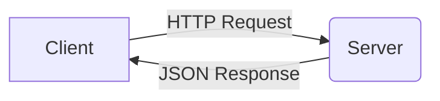

# Шпаргалка по Markdown

**Markdown** — це мова розмітки для інженерів. Вона дозволяє форматувати текст, не відриваючи рук від клавіатури.
Цей курс (і весь GitHub) написаний на Markdown.

---

## Основні елементи

### Заголовки
```markdown
# H1 (Назва лекції)
## H2 (Розділ)
### H3 (Підрозділ)
````

### Форматування тексту

```markdown
**Жирний текст** (важливо)
*Курсив* (акцент)
`Сrossed out` (код в рядку)
```

### Списки

**Невпорядкований:**

```markdown
* Пункт 1
* Пункт 2
    * Підпункт
```

**Впорядкований:**

```markdown
1. Крок перший
2. Крок другий
```

-----

### Код (Найважливіше)

Щоб вставити блок коду з підсвіткою синтаксису:

\`\`\`javascript
function hello() {
console.log("Hello World");
}
\`\`\`

Виглядає як:

```javascript
function hello() {
    console.log("Hello World");
}
```

-----

### Посилання та Картинки

```markdown
[Текст посилання](https://google.com)

```

### Цитати (Notes)

```markdown
> Це важлива думка або попередження.
```

> Це важлива думка або попередження.

-----

## Інженерні діаграми (Mermaid)

GitHub підтримує малювання схем кодом:

\`\`\`mermaid
graph LR;
A[Client] --\>|HTTP Request| B(Server);
B --\>|JSON Response| A;
\`\`\`

**Результат:**

